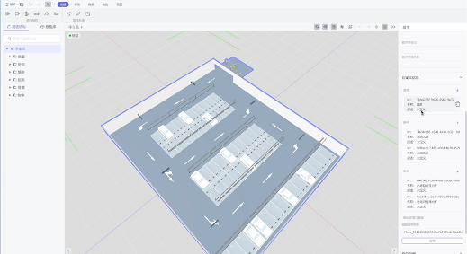
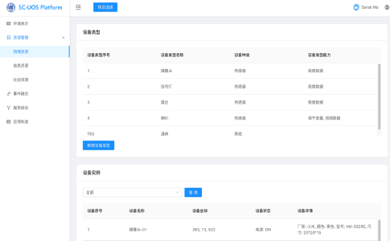
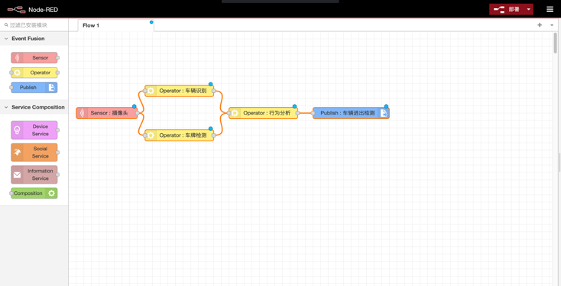
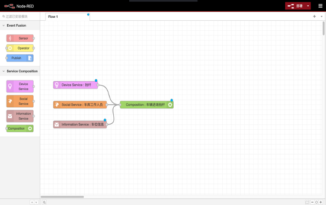
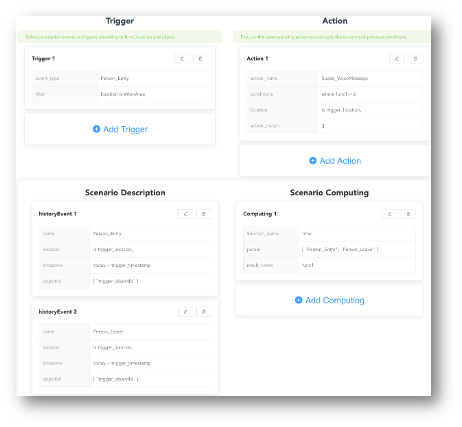

# 智慧城市泛在操作系统及工具集合

## 项目概述
本项目旨在开发面向智慧城市场景的泛在操作系统（UOS），提供一系列低代码工具和平台支持，帮助用户构建、部署和运行人机物融合的智慧城市应用。通过这些工具，可以实现对城市中各种资源的抽象管理、事件融合处理以及应用的低代码开发与部署。

## 工具集合
项目包含以下主要工具：

### 1. 数字空间表征模块 (DigitalSpaceStudio)
- **功能**：展示数字空间中的建筑及其内部设备信息，通过3D模型的形式展现所选建筑的布局和设备分布。
- **特点**：
  - 提供建筑和楼层的选择功能，可自由选择特定建筑、楼层和房间进行展示。
  - 支持设备信息的展示，包括设备名称、部署位置、状态等信息。

  

### 2. 人机物资源管理工具 (ResourcePlat)
- **功能**：管理智慧城市场景中的各类设备、信息和社会资源。
- **特点**：
  - 设备类型管理：展示空间内的设备类型及其详细信息。
  - 资源状态监控：支持对设备、信息和社会资源的实时监控和管理。
  - 资源增删功能：支持手动添加或删除资源实例。

  

### 3. 环境事件融合工具 (EventFusion)
- **功能**：配置和处理环境中各种传感器事件，进行数据处理和事件输出。
- **特点**：
  - 支持传感器数据的采集和初始化设置。
  - 通过算子节点处理数据，可进行简单运算或调用外部API。
  - 规则配置和部署，支持将处理后的数据发送至数据库。

  

### 4. 环境服务组合工具 (ServiceComp)
- **功能**：将设备功能或资源组合成服务，为复杂应用提供支撑。
- **特点**：
  - 能力组合配置：通过添加节点，将不同设备或资源的能力组合成服务。
  - 服务部署：生成JSON文件并传输至后端，自动更新服务列表。

  

### 5. 智慧城市场景泛在应用低代码开发工具 (AppCoder)
- **功能**：提供低代码的应用构建平台，支持事件驱动的应用开发。
- **特点**：
  - 应用元模型：基于事件、条件和执行动作的模型进行应用开发。
  - 可视化界面：支持直观的UI操作，便于配置复杂的事件条件。

  

## 项目特点
- **低代码开发**：通过图形化工具和可视化界面，降低开发门槛。
- **资源统一管理**：支持对各种人机物资源的抽象管理和状态监控。
- **事件驱动**：支持基于事件的触发执行，提高应用的响应性和智能性。
- **服务组合**：通过组合已有设备和服务，灵活构建应用功能。

## 使用场景
### 1. 居民社区
- **应用示例**：非法停车检测、消防通道监控、智能照明控制等。

  

### 2. 商业园区
- **应用示例**：会议室预约、办公环境准备、节能管理等。

  

### 3. 市民城区
- **应用示例**：智能停车场管理、道路安全监控、公共设施管理等。

## 项目进展
- 数字空间表征模块已完成初步开发，可展示3D空间模型。
- 人机物资源管理工具支持设备类型和状态的管理。
- 事件融合工具和服务组合工具已具备事件配置和服务部署功能。
- 低代码开发工具AppCoder支持事件驱动的应用开发。
- 数据库Docker启动
  docker start smart_city_system_db_1