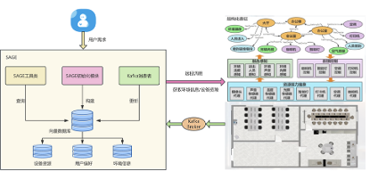

# 智慧城市泛在操作系统及工具集合

## 项目概述

智慧城市泛在操作系统是一个面向智慧城市场景打造的泛在操作系统平台，旨在实现城市中各类资源的统一管理和智慧场景的高效构建。这个平台包含四大核心模块：资源管理、事件融合、服务组合和应用构造。

资源管理模块方便接入管理物理资源、社会资源和信息资源；事件融合模块通过低代码方式构建产生事件的规则，并通过执行引擎不断执行以发布环境级事件；服务组合模块采用低代码方式将不同资源功能按顺序组合，生成组合服务；应用构造模块将事件融合模块的事件作为触发器（trigger），服务组合模块的服务作为动作（action），构建规则化智慧服务。

此外，平台深度集成了AI Agent助手，利用大语言模型（LLM）能力，实现运行态智慧场景，结合泛在操作系统的部署态智慧场景，打造全态智慧场景体系。

平台整体通过“感知-理解-响应”的智慧闭环，实现城市级智能调度与管理。

## 平台核心模块

1. **资源管理模块**
    - 支持对智慧城市各级空间结构（如园区、楼宇、房间）及其下属资源（物联网设备、计算节点、数据系统）的统一视图化管理。
    - 提供资源接入机制，支持物理设备、信息系统、外部服务的动态纳管和状态同步。
    - 所有资源信息构成平台的环境表征基础，支撑智能调度与推理。

2. **事件融合模块**
    - 基于改造后的 Node-RED 实现低代码事件构造工具，提供三类功能模块：  
      - Sensor：选择设备及功能接口，接收实时感知数据；  
      - Operator：处理数据，包括基本算子（比较、阈值判断）和复杂算子（人脸识别、语音识别API）；  
      - Publish：将处理事件转化为语义事件类型，更新环境表征，通过Kafka发布。
    - 事件触发逻辑通过拖拽构建，降低开发门槛。

3. **服务组合模块**
    - 采用低代码方式组合多个服务单元，形成智能响应流程。
    - 结合事件驱动与服务编排，实现“感知-判断-执行”闭环。
    - 支持灵活指定服务调用顺序、条件逻辑和数据传递，提升效率和可维护性。

4. **应用构造模块**
    - 提供应用打包与部署能力，将规则、事件流、服务流整合成完整场景应用。
    - 支持边缘部署、云端托管和本地测试，满足多场景需求。

## AI Agent 能力集成

平台集成基于大语言模型（如 Qwen-32B）构建的 AI Agent，部署于 Ollama 框架，并与泛在操作系统深度融合。该智能体实现从规则构建到智能调度的转变：

- **环境表征增强推理**  
  项目启动时，环境数据（设备信息、空间状态、事件上下文）被伪自然语言化，构建向量数据库，支持基于RAG的上下文检索。

- **智能调度机制**  
  事件发生或用户请求时，平台通过环境更新和prompt构造，引导AI Agent检索环境状态，调用适配工具，执行设备控制或任务。

- **工具链与指令映射**  
  包含用户偏好查询、环境信息提取、设备控制等多个工具，自动从语义构造API调用路径，实现灵活交互。

这种机制支持传统部署流程和生成式AI的即时响应，动态生成控制逻辑和任务流，形成“感知-理解-响应”的智慧闭环。

---

## 工具集合

项目包含以下主要工具：

### 1. 数字空间表征模块 (DigitalSpaceStudio)

- **功能**：展示数字空间中的建筑及其内部设备信息，通过3D模型展示所选建筑布局和设备分布，同时查看空间和设备的3D模型，展示空间资源和属性。
- **特点**：
  - 支持建筑、楼层、房间选择展示。
  - 显示设备名称、部署位置及状态。

  

### 2. 人机物资源管理工具 (ResourcePlat)

- **功能**：管理智慧城市场景中的物理资源、信息资源和社会资源，实现资源的接入与管理。
- **特点**：
  - 统一视图管理空间结构及其下属资源。
  - 支持单个或批量物理资源接入，设备数据推送（如麦克风消息队列，非物联网设备需服务化封装）。
  - 管理信息资源（会议室预约系统等，包含功能URL）及社会资源（保安、保洁等人力资源）。
  - 资源状态监控和增删功能。

  

### 3. 环境事件融合工具 (EventFusion)

- **功能**：基于改造后的 Node-RED，构建、查看、执行环境事件规则。
- **特点**：
  - Sensor采集设备实时数据。
  - Operator处理传感数据（基本算子及复杂API）。
  - Publish转化并发布语义化事件。
  - 低代码拖拽构建规则，便于非开发人员使用。

  

### 4. 环境服务组合工具 (ServiceComp)

- **功能**：低代码方式组合设备或资源功能，形成智能服务响应流程。
- **特点**：
  - 支持服务调用顺序、条件和数据传递配置。
  - 后端服务执行引擎执行流程。
  - 结合事件驱动完成智能“感知-判断-执行”。

  

### 5. 智慧城市场景泛在应用低代码开发工具 (AppCoder)

- **功能**：基于事件融合提供的事件（Trigger）与服务组合的服务（Action），加入判断条件，构造规则化智慧应用脚本（Sctap）。
- **特点**：
  - 应用元模型支持复杂事件条件配置。
  - 直观可视化界面，支持低代码开发。

  

### 6. 智慧城市平台 - LLM Agent工具

- **功能**：智能助手，结合环境表征和用户偏好，基于大语言模型进行智能交互与调度。
- **特点**：
  - 环境与用户偏好初始化向量库。
  - 大模型推理结合多工具，自动完成任务。
  - 支持个性化智慧场景响应，如智能播放电视节目。

  
 

## 项目特点

- **低代码开发**：图形化工具降低开发门槛。
- **资源统一管理**：抽象管理多类型资源。
- **事件驱动**：触发执行提高智能响应。
- **服务组合**：灵活构建复杂应用功能。
- **智能助手支持**：生成式AI与环境数据结合，实现智慧闭环。

## 使用场景

### 1. 居民社区

- **应用示例**：非法停车检测、消防通道监控、智能照明控制等。

  

### 2. 商业园区

- **应用示例**：会议室预约、办公环境准备、节能管理等。

  

### 3. 市民城区

- **应用示例**：智能停车场管理、道路安全监控、公共设施管理等。