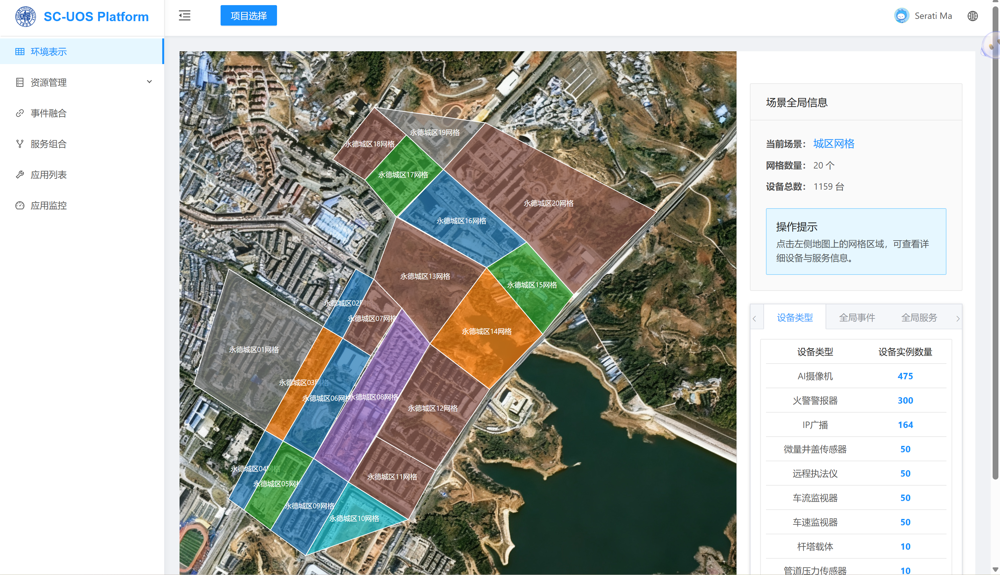
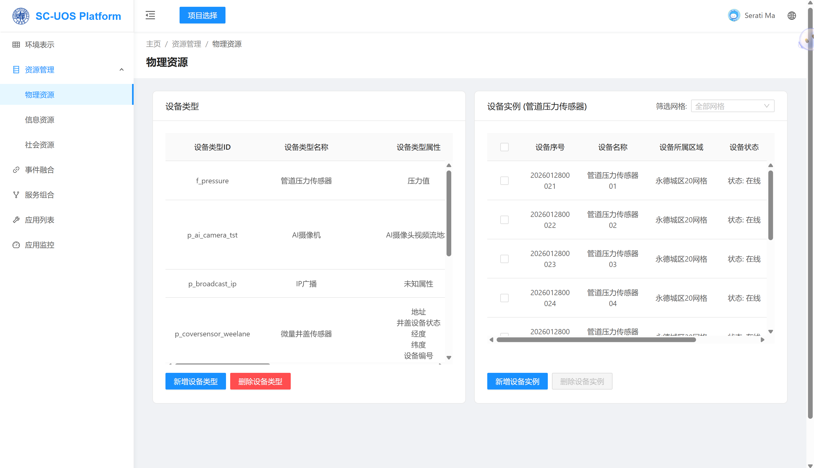
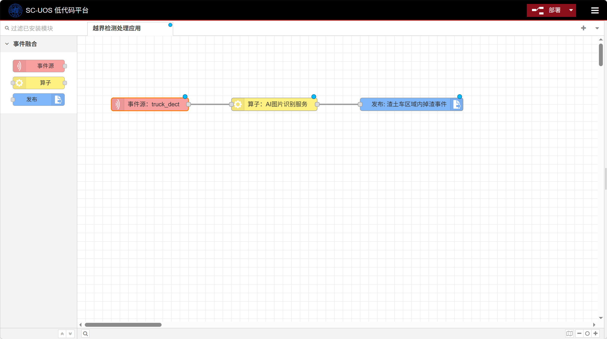

# 智慧城市泛在操作系统及工具集合

## 项目简介

智慧城市泛在操作系统是一个面向智慧城市场景的统一支撑平台，旨在对城市中的空间、资源、事件与服务进行一体化管理，并为场景化智能应用的开发、部署与运行提供完整支撑。平台围绕“感知—理解—响应”的运行闭环，将底层异构资源接入、环境事件处理、服务能力编排与上层应用构造贯通起来，支撑智慧社区、商业园区、城市治理等多类场景的快速落地。

平台整体由资源管理、事件融合、服务组合和应用构造四类核心能力组成。资源管理负责统一纳管物理资源、信息资源与社会资源，形成环境表征基础；事件融合负责将多源感知数据处理并抽象为可被理解和消费的环境级事件；服务组合负责将异构能力组织为可执行的服务流程；应用构造则面向场景需求，将触发条件、规则逻辑与响应动作组织为可复用的智慧应用。

## 核心模块

### 1. 资源管理

平台支持对城区、园区、社区等多级空间结构及其下属资源进行统一管理，覆盖物联网设备、计算节点、数据系统和社会服务等多种资源类型。通过统一接入与状态同步机制，系统能够形成面向后续事件处理、服务调度与应用执行的环境表征基础。

### 2. 事件融合模块

平台提供低代码事件融合能力，支持围绕事件源接入、规则处理和环境级事件发布构建完整流程。开发者可以基于拖拽式方式组合不同节点，对实时感知数据进行过滤、计算、识别和关联，并将处理结果发布为环境级事件，为后续应用执行提供触发条件。

### 3. 服务组合

平台提供低代码服务编排能力，支持对设备服务、信息服务和社会服务进行统一组织与调用。通过服务组合，可以灵活定义调用顺序、条件逻辑和数据传递关系，将分散能力整合为可复用、可执行的环境级服务。

### 4. 应用构造

平台提供面向场景的低代码应用构造能力，支持基于触发事件、条件分支、服务调用和延时等待等节点构建规则化应用。系统同时支持结合大模型能力进行自然语言辅助生成与应用推荐，降低复杂场景应用的开发门槛。

## 工具集合

### 1. 数字空间表征模块 (DigitalSpaceStudio)

用于展示数字空间中的区域划分、网格结构和设备分布信息。系统以二维网格化方式对场景空间进行可视化表达，支持分层展示不同区域及其资源布局，便于理解场景范围、空间边界和设备分布情况。



### 2. 人机物资源管理工具 (ResourcePlat)

用于统一管理物理资源、信息资源和社会资源，支持资源接入、状态查看与运维管理，为平台运行提供基础资源支撑。



### 3. 环境事件融合工具 (EventFusion)

用于构建、查看和执行环境事件融合规则，支持从设备数据采集、规则处理到环境级事件发布的完整流转过程。



### 4. 环境服务组合工具 (ServiceComp)

用于通过低代码方式编排资源能力，形成可执行的服务流程，支持顺序控制、条件判断与数据传递。

.png)

### 5. 智慧城市场景泛在应用低代码开发工具 (AppCoder)

用于将触发事件、条件逻辑和响应动作组合为规则化场景应用，支持低代码配置与场景应用生成。

.png)


## 使用场景

### 居民社区

- 适用于非法停车检测、消防通道监控、智能照明控制等社区治理与服务场景。


### 商业园区

- 适用于会议室预约、办公环境准备、能耗优化与环境联动管理等场景。


### 市民城区

- 适用于智能停车管理、道路安全监测、公共设施协同处置等城市治理场景。

## 仓库结构

```text
smart_city_system/
├─ backend/                后端服务
├─ frontend/               前端页面
├─ node-red/               低代码工具
├─ .node-red/              低代码工具运行配置
├─ docker-compose.yml      容器编排文件
├─ cloud-services.yaml     KubeEdge 云端部署文件
├─ edge-services.yaml      KubeEdge 边缘部署文件
├─ readme_img/             README 配图
└─ README.md               项目说明文件
```

## 快速开始

### 技术栈

项目采用前后端分离与低代码协同的整体架构。后端基于 Java 17、Spring Boot、Spring Security、Spring Data JPA、WebSocket 等技术构建，结合 MySQL、Kafka、Redis、Neo4j、Milvus 等基础设施实现数据管理与消息处理；前端基于 Vue 2、Vue CLI 和 Ant Design Vue 构建；低代码能力基于 Node-RED 实现。模型服务支持通过 DashScope 或 OpenAI 兼容接口接入。

### 访问入口

默认情况下，主要服务入口如下：

+ 前端：`http://localhost:8000`
+ 后端 API：`http://localhost:8080`
+ Swagger 文档：`http://localhost:8080/swagger-ui.html`
+ Node-RED：`http://localhost:1880`
+ 边缘节点示例：`http://localhost:8081`、`http://localhost:8082`、`http://localhost:8083`

### 环境准备

建议准备以下开发环境：

+ JDK 17
+ Maven 3.9+
+ Node.js 18.5+（Node-RED）
+ Node.js 20 与 Yarn 1.x（前端）
+ Docker / Docker Compose

此外，系统运行依赖 MySQL、Kafka、Redis、Neo4j、Milvus 等外部基础设施，请根据实际环境提前准备。

### 配置说明

前端配置文件位于 `frontend/.env` 和 `frontend/.env.server`，主要用于设置后端接口地址、Node-RED 地址、WebSocket 地址以及模型服务相关参数。后端配置位于 `backend/src/main/resources/application.properties`，其中包含数据库、中间件、模型服务以及部署模式等参数。
部署前建议重点检查以下内容：

+ 数据库、Kafka、Redis、Neo4j、Milvus 等连接地址是否正确
+ 各类账号、密码、Token、API Key 是否已替换为目标环境配置
+ app.deploy-mode、app.node-role、app.cloud-url 等部署参数是否与实际模式一致
+  docker-compose.yml 中引用的固定地址是否已调整为本地或目标环境地址

### 本地开发

启动后端：

```bash
cd backend
mvn spring-boot:run --add-opens java.base/java.lang=ALL-UNNAMED
```

启动前端：

```bash
cd frontend
yarn install
yarn serve
```

启动Node-RED：

```bash
cd node-red
npm install
npm start -- --userDir ../.node-red
```

### 容器部署

如需使用 Docker 启动主要服务，可在完成配置修改后执行：

```bash
docker compose up --build -d
```

停止服务：

```bash
docker compose down
```

当前容器编排默认包含云端后端、多个边缘节点、前端与 Node-RED 服务，但不包含 MySQL、Kafka、Redis、Neo4j、Milvus 等外部依赖，这些组件需要自行准备。

### KubeEdge部署

项目同时提供了 KubeEdge 部署文件，可用于已有集群环境下的云边协同部署：

```bash
kubectl apply -f cloud-services.yaml
kubectl apply -f edge-services.yaml
```

使用前请确认镜像地址、端口映射、节点选择策略及依赖服务地址均已按照目标环境完成调整。

### 说明

本仓库同时包含智慧城市泛在操作系统的核心平台能力与相关工具集合，适用于智慧社区、园区管理、城市治理等多类场景的研究、验证与应用开发。若需在新环境中部署，建议优先完成基础设施与配置参数核对，再按照本地开发或容器部署方式逐步启动各模块服务。
